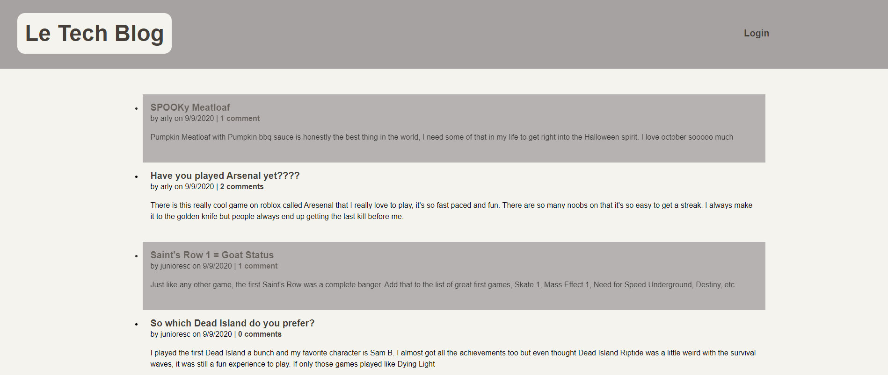
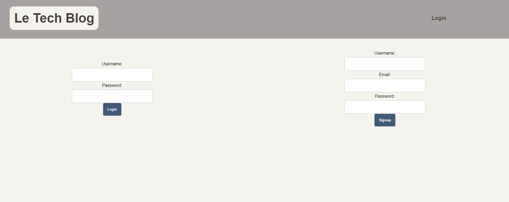
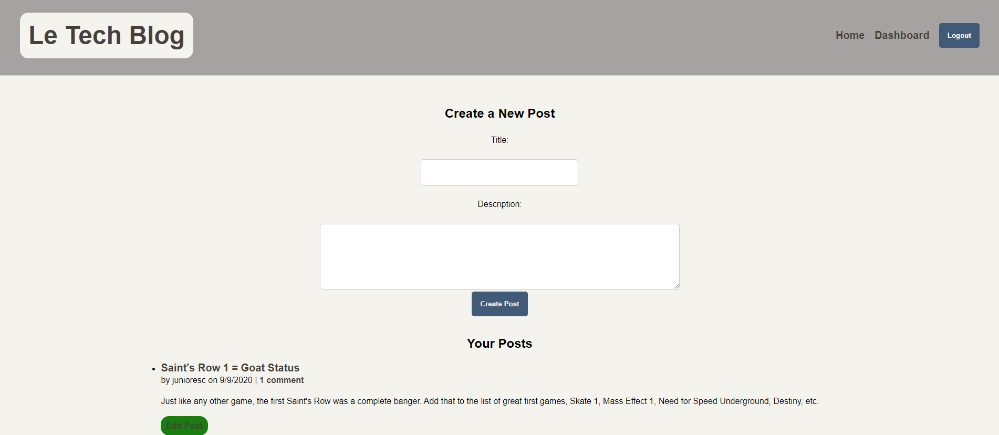
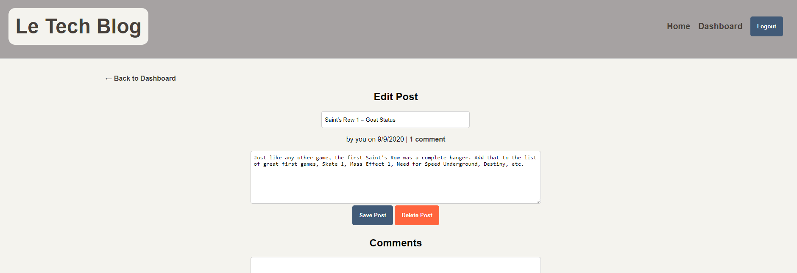

# Tech Blog

## Description

The tech blog is a full stack application, incorporating express and sequelize to talk to the mySQL database. It dynamically renders the webpages using handlebars and feature's authentication for users to be able to log in and post a page with a title and description kinda like reddit

## Table of Contents

* [Usage](#usage)
* [License](#license)
* [Questions](#questions)
    
## Usage

Once you get onto the homepage, you can see the posts that other users entered and if you click on a title then you'll be able to see what people have commented
    

Click the login button to be taken to the login page, to your left you can sign in and to the right you can enter a username, email, and password to sign up for the website.

Once you log in you will be taken to the dashboard page where you can add a post or see and edit the posts that you have already made, you can click on the home button to be taken back to the homepage and now since you're logged in you can comment on posts people have made

#### Link to site

https://tech-blog215.herokuapp.com/

## License

Licensed under the [MIT License](LICENSE.txt).

## Questions

My [GitHub](https://github.com/junioresc/)  
If you have any additional questions and would like to reach me, you can at junioresc1092@gmail.com